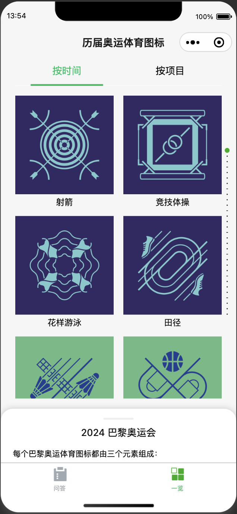
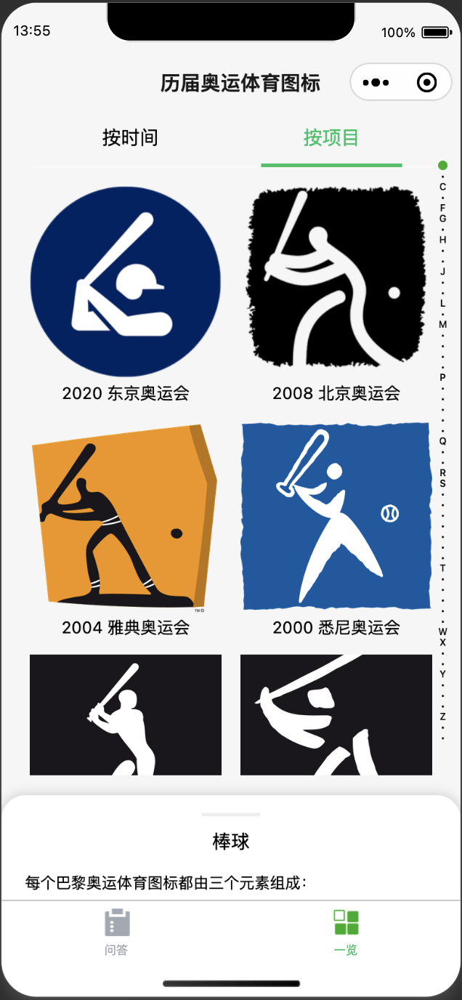
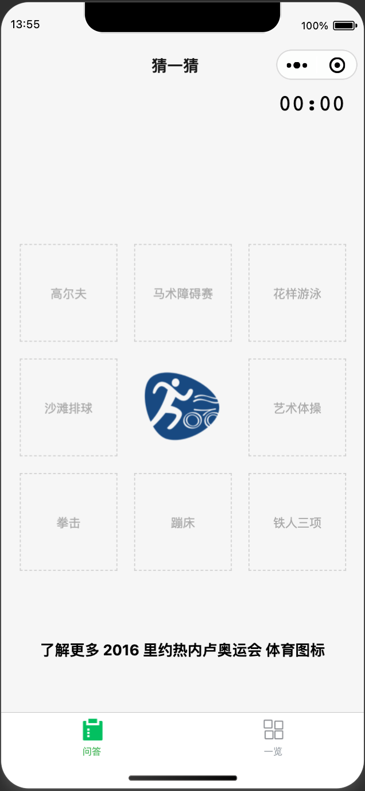

# wechat-miniprogram-pictograms

a wechat miniprogram for olympic pictograms exploring. You can explore them chronologically or by sports.

inspired by [the olympic design](https://www.theolympicdesign.com/olympic-games/pictograms/)

## some components

I want to explore what can be done with wechat miniprogram, and this project is heavily influenced by [wechat-miniprogram-demo](https://github.com/wechat-miniprogram/miniprogram-demo).

I am surprised at those demos are quite uneasy to be integrated to components. They are organized as separate pages. So I try to make them as components here. You can find `segmented-half-screen`, `sliding-tabs`, `address-book-slider` in the components folder.

## some screenshots

